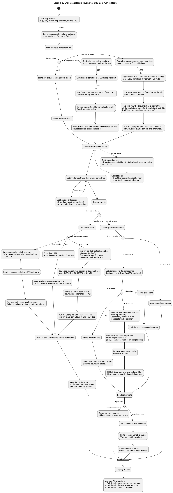

```
Abstractions in pen;
protocols for protocols.
Recipes for glue
```
This post is mostly a wandering journey looking at impacts of "EIP-4444: History Expiry"
(a facet of The Purge), which necessitates alternative history access.
The Portal Network is positioned to provide that access, and I am interested in what are
the flow on effects of "sweeping away" history.

&#x2728;&#x1F9F9;&#x1F32A;

What will it be like to use a light-weight client?

What are some pieces that are important in the story?

I start out poking around with a few ideas. That leads to some code,
then to a spec, and a few other ideas. I hope you enjoy this informal journey with me.

Really it started with this kernel of an idea:
```sh
Introspection on ones own wallet is not really possible without a bit
of trust-hand-waving or a trusty dedicated ubuntu machine.

But it could be! The ingredients seem to be there at least.
```

> prōtos "first" + kolla "glue"

---

|Part|Question|Answer|
|-|-|-|
|[Part I: Musing](poking/part_1.md) | Is there an underserved user in the history-expiry roadmap? | Yes, a regular wallet user |
|[Part II: Code](poking/part_2.md) | Can you divide a useful index into tiny useful parts? | Yes, prototype |
|[Part III: Specifying](poking/part_3.md) | Could other clients use a divided index? | Yes, with a spec |
|[Part IV: Examining](poking/part_4.md) | Does a divided index result in anything useful? | Yes, personal history |
|[Part V: Remotes](poking/part_5.md) | Can remote resources make tx history human-readable? | Yes, through decoding and ABIs |
|[Part VI: Acquisitions](poking/part_6.md) | Can useful remote resources become distributed? | Yes, by generalising a format |
|[Part VII: Coalesce](poking/part_7.md) | Is a local, lighthweight personal history browser a good idea? | It's plausibly so |
|[Part VIII: Hoovering](poking/part_8.md) | Can private API-based database curators coexist with distributed database design? | Yes, by standards for distribution |

---


If you like, these are the spoilers that came out of this:

- A meta-specification for a "Volumes and Chapters" publishing model.
    - A formula for making data updateable, shardable and publisher-agnostic.
        - Updateable (CIDs never change)
        - Shardable (users can get subsets that are relevant to them)
        - Publishser-agnostic (publishing is a protocol that anyone can follow)
    - It is a meta-spec because it is a spec that other specs can comply with.
    - [https://github.com/perama-v/TODD](https://github.com/perama-v/TODD)
- A rust library using generics to implement the "Volumes and Chapters" publishing model.
    - Allows arbitrary datastructures/databases to be converted into a "Volumes and Chapters" publishing model.
    - [https://github.com/perama-v/min-know](https://github.com/perama-v/min-know)
- A specification for transformation of the UnchainedIndex into a "Volumes and Chapters" publishing model.
    - Used to discover your own transactions with minimal data
    - Complies with the "Volumes and Chapters" TODD meta-spec.
    - [https://github.com/perama-v/address-appearance-index-specs](https://github.com/perama-v/address-appearance-index-specs)
- A smart contract standard for publishing.
    - The "Volumes and Chapters" meta-spec outlines a manifest-based publishing model.
    - A smart contract allows cencorship-resistant posting of IPNS names and publishing topics.
    - [https://github.com/perama-v/GAMB](https://github.com/perama-v/GAMB)
- A simple address exploration rust application that puts everything together.
    - Tries to get wallet history with <1GB data and no APIs
    - Essentially consists of
        - An experimental "Volumes and Chapters" variant of the UnchainedIndex.
        - A Portal node.
        - The Heimdall decompiler.
        - (TODO) Experimental "Volumes and Chapters" variants of 4byte registry, Sourcify and a names/tags database.
    - [https://github.com/perama-v/PSR_B0943_10](https://github.com/perama-v/PSR_B0943_10)

The direction of this user interface demo is something like:

```
[User: Clicks on their wallet]

Address 0x846b...4cb9 (imagine this is "your-wallet")

Has had 2 transactions

Transaction 1
    - WETH Deposit
        - to UniswapV2-router
        - wad 140000000000000000 (0.14 tokens)
    - WETH Transfer
        - from UniswapV2-router
        - to UniswapV2-pair
        - wad 140000000000000000 (0.14 tokens)
    - LABRA Transfer
        - from UniswapV2-pair
        - to your-wallet
        - amount 55479990315601131228 (55479990315 tokens)
    - UniswapV2 Sync
        - reserve0 27434359272513446845001
        - reserve1 67780564455540887653
    - UniswapV2 Swap
        - sender UniswapV2-router
        - amount0In 31062407892934044
        - amount1In 140000000000000000
        - amount0Out 56612235015919521660
        - amount1Out 0
        - to your-wallet

Transaction 2
    - ...
        - some loan
        - a multisig approval
        - a NFT acquisition
        - ...
```

It's a little plain, but it is also evident what "transaction 1"
is roughly about. This interface is possible in a resource
constrained device in a post-EIP-4444 world. Where the full
decentralised local mini-account explorer
for a user could be <1GB.

Using theoretical combination of:
- Portal network client
- Pieces of special distributable databases:
    - An index of address appearances
    - An event signature database
    - A contract ABI database
- A broadcasting system to get the manifests of:
    - The index
    - The event signature database
    - The contract ABI database

The how-s and the why-s are covered in post-s.

Here is a diagram of the idea. Scan for the 4 appearances of
the word "BONUS" so find the interesting parts. The game
is to get to the bottom without using an API.

For higher resolution, try the [SVG version](./poking/diagrams/source.svg).



